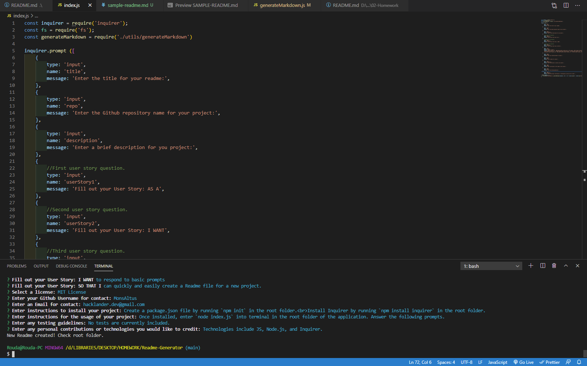
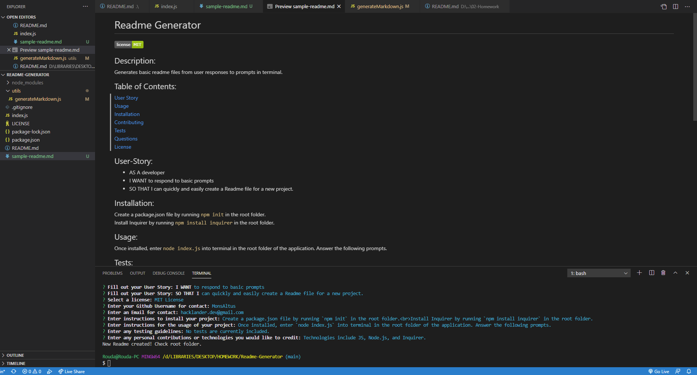

# Readme-Generator
## A readme generator using Node.js

### Description:
This project creates a basic Readme file for your Github application. It displays prompts in the termial, and uses the response to fill out a template. 

### User Story:
- AS A developer on Github
- I WANT to respond to basic prompts for input
- SO THAT I can quickly and easily create a professional Readme for a new project

### Install:
Create a package.json file by running `npm init` in the root folder. 
Install Inquirer by running `npm install inquirer` in the root folder.

### Technologies Used:
- JavaScript
- Node.js
- Inquirer
- Shields.io

### App Preview:
[Video of the app running in VSCode](https://drive.google.com/file/d/1VuEWL-9JsZqcP2GpLFsRK5DraWblc4mC/view?usp=sharing) 
 
 